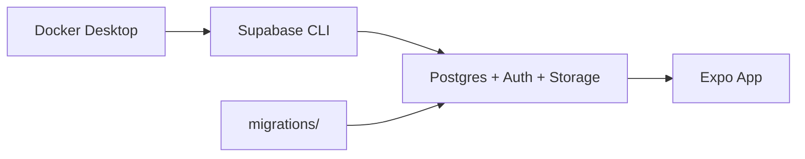

# Arquitectura HOMPANY

## Stack técnico

| Capa | Tecnología |
|------|------------|
| Mobile | React Native + Expo + Expo Router |
| Lenguaje | TypeScript (`strict: true`) |
| Backend | Supabase (PostgreSQL, RLS, Auth, Realtime, Storage) |
| Validación | Zod |
| Estilos | NativeWind v4 + tokens teal/cream (`interactive-styles`) |
| Monetización | RevenueCat (`hompany_plus`) — ver [`monetization.md`](./monetization.md) |
| Tests | Jest (`jest-expo`) + React Native Testing Library |

## Estructura de carpetas

```
app/                    # Solo routing (Expo Router)
  (tabs)/               # Inicio | Tareas | Gastos | Ajustes
  _layout.tsx           # Providers globales + global.css

src/
  components/ui/        # Componentes UI reutilizables (Screen, Button, Card...)
  features/             # Módulos por dominio (home, tasks, history...)
  hooks/                # Custom hooks
  lib/                  # Cliente Supabase, env, utilidades
  providers/            # Context providers (AppProviders, Auth, Home...)
  schemas/              # Esquemas Zod compartidos
  types/                # Tipos TS (database.types, task-status...)

supabase/
  config.toml           # Config local Supabase CLI
  migrations/           # Migraciones SQL versionadas
  seed.sql              # Datos de desarrollo

__tests__/              # Tests unitarios/integración
```

## Reglas de arquitectura

### Multi-tenancy (`home_id`)

Un usuario puede pertenecer a múltiples hogares. **Toda** consulta o mutación sobre datos de hogar debe filtrar explícitamente por el `home_id` activo. Nunca consultar tablas vinculadas a hogares sin ese filtro.

Documentado en [`src/lib/supabase/client.ts`](../src/lib/supabase/client.ts) y enforced en cliente con [`requireHomeId`](../src/lib/home/require-home-id.ts).

### Modelo de datos (Paso 2)

| Tabla | Rol |
|-------|-----|
| `profiles` | Perfil 1:1 con `auth.users` (trigger al signup) |
| `homes` | Hogar / piso compartido (`invite_code`) |
| `home_members` | Membresía (`owner` \| `member`) + reputación |
| `member_absences` | Ausencias puntuales (solo tareas) |
| `member_presence_periods` | Estancia en el piso (meses o fechas) |
| `member_system_leaves` | Ausencia indefinida/planificada (congela el sistema) |
| `home_item_types` | Tipos personalizados de tareas/gastos |
| `member_exam_periods` | Periodos de exámenes / estudio intenso (`label`) |
| `tasks` | Instancia de tarea con `home_id` obligatorio y `task_status` |

RLS: solo miembros del piso pueden leer/escribir datos de ese `home_id`. Helpers SQL: `is_home_member`, `is_home_owner`.

Migración: [`supabase/migrations/20260816120000_initial_schema.sql`](../supabase/migrations/20260816120000_initial_schema.sql).

### Máquina de estados de tareas

Toda instancia de tarea sigue estos estados (definidos en [`src/types/task-status.ts`](../src/types/task-status.ts)):

| Estado | Descripción |
|--------|-------------|
| `PENDING` | Asignada con fecha límite |
| `SUBMITTED` | Foto subida, en espera de aprobación |
| `COMPLETED` | Aprobada por compañeros |
| `OVERDUE` | Vencida sin entrega |
| `RESOLVED_LATE` | Completada tarde por el asignado |
| `RESOLVED_BY_PEER` | Completada por otro compañero |
| `SKIPPED` | Cancelada por consenso |

### Convención de rutas delgadas

Los archivos en `app/` solo importan y exportan pantallas desde `src/features/`. La lógica de negocio vive en `src/features/`, no en las rutas.

## Flujo de desarrollo local



1. `npm run db:start` — levanta Supabase local
2. Configurar `.env.local` con URL `http://127.0.0.1:54321` y la anon key de `npm run db:status` (no pongas la IP de la Wi‑Fi: caduca)
3. `npm start` — arranca la app (web usa loopback; Expo Go reescribe al host de Metro)
4. `npm test` — verifica regresiones

Si ves `AuthRetryableFetchError: Failed to fetch` / `Host unreachable`: Supabase está mal apuntado (IP LAN vieja) o no escucha en `:54321`. Corrige `.env.local` a `127.0.0.1` y reinicia Expo.

## Autenticación y hogar activo (Paso 3)

- `AuthProvider`: sesión Supabase persistida con AsyncStorage
- `HomeProvider`: `activeHomeId` en AsyncStorage (`hompany.activeHomeId`)
- Gate de navegación: sin sesión → login; sin hogar → setup; con ambos → tabs
- Home: secciones Pulso | Agenda | Piso; avisos en campanita; ausencias/silencio/visitas en ⋮
- Tutorial interactivo v2 (`TutorialProvider`)
- RPCs: `create_home`, `get_home_by_invite_code`, `join_home_by_invite_code`, `leave_home`, `kick_home_member`, `delete_own_account`, `get_home_leaderboard`.

Documentación de producto: [`PRODUCT.md`](./PRODUCT.md), periodicidad: [`recurrence.md`](./recurrence.md), avisos: [`notifications.md`](./notifications.md).

## Tablero de tareas (Paso 4)

- Listado/creación siempre filtrados por `activeHomeId`
- Cards con countdown y acciones `PENDING → SUBMITTED → COMPLETED`
- Home Pulso con salud del piso (`summarizeTasks`), clasificación (`get_home_leaderboard`), agenda con calendario colapsable (`AgendaCalendar`) y lista sincronizada (`AgendaList`); filtros Mis cosas / Compañeros (`toAgendaScopeFilter`); leave de sistema en menú ⋮; secciones Pulso / Agenda / Piso
- Tipos personalizados de tareas/gastos (`home_item_types` + `item_type_id`); tablero de tareas sin Zonas (solo QUICK + custom)
- Gastos visibles solo para involucrados (RLS vía `is_expense_participant`); omitir fecha (`SKIPPED` / `skipped_dates`) sin romper la serie
- **Ausencias** (`member_absences`): registro en Agenda; la rotación automática excluye ausentes; si todos están ausentes en una fecha, se omite la ocurrencia (`skipped_dates`)
- **Exámenes / modo silencio** (`member_exam_periods`): registro en Agenda; **no** altera rotación; calendario con franjas `📚 Exámenes: [Label]`; aviso antes de impugnar/notificar directamente al compañero en exámenes
- Historial con tareas cerradas

### Seed local (desarrollo)

| Email | Password | Rol |
|-------|----------|-----|
| `ana@hompany.local` | `password123` | owner del Piso Demo |
| `bruno@hompany.local` | `password123` | member |

Invite code: `DEMO2026`.

## Fuera de alcance (post-Shipaton)

- Realtime multi-dispositivo (hoy solo `board-sync` in-process entre tabs)
- CI/CD y EAS Build de producción
- Asignación semanal automática de tareas
- Push remoto (ver [`notifications.md`](./notifications.md))

## Monetización (Shipaton)

- Entitlement `hompany_plus` vía RevenueCat; packs de iconos no-Clásico gated.
- Provider: [`PurchasesProvider`](../src/providers/PurchasesProvider.tsx). Docs: [`monetization.md`](./monetization.md).
