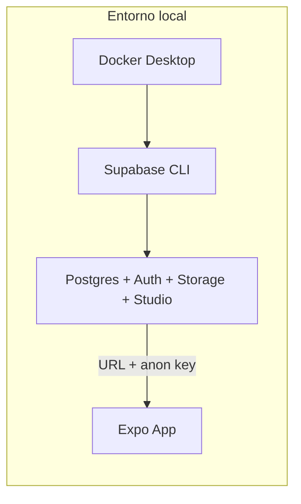
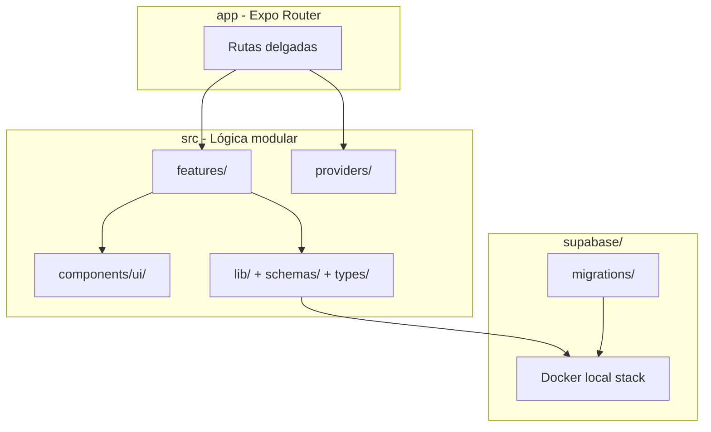

# Plan: Inicialización base del proyecto HOMPANY (Paso 1)

## Contexto

El repositorio solo contenía [`.cursorrules`](../../.cursorrules). No había código, dependencias ni configuración previa.

**Preferencias confirmadas:** npm como gestor de paquetes y **Supabase local** (CLI + Docker) desde el inicio.

**Stack obligatorio según reglas del proyecto:**

| Capa | Tecnología |
|------|------------|
| Mobile | React Native + Expo + Expo Router (file-based) |
| Lenguaje | TypeScript estricto (`noImplicitAny: true`) |
| Backend | Supabase (PostgreSQL, Auth, Realtime, Storage, RLS) |
| Validación | Zod |
| Estilos | NativeWind v4 (Tailwind para RN) |
| Tests | Jest (`jest-expo`) + React Native Testing Library |

---

## Prerrequisitos del entorno de desarrollo

Antes de ejecutar el plan, verificar en la máquina:

1. **Node.js 20+** y npm
2. **Docker Desktop** instalado y en ejecución (requerido por `supabase start`)
3. **Git** (repo ya existe)
4. Opcional: **Expo Go** en dispositivo o emulador Android/iOS para probar la app

---

## Fase 1: Scaffold del proyecto Expo

### 1.1 Crear app base

Inicializar en el directorio actual preservando `.cursorrules`:

```bash
npx create-expo-app@latest . --template tabs
```

El template `tabs` incluye Expo Router con navegación por pestañas, alineado con las pantallas clave del producto (Home, Tareas, Historial).

Si el CLI rechaza el directorio no vacío, alternativa: crear en subcarpeta temporal y mover archivos al root, conservando `.cursorrules`.

### 1.2 TypeScript estricto y alias de rutas

Ajustar [`tsconfig.json`](../../tsconfig.json):

- `"strict": true` (incluye `noImplicitAny`)
- Path alias `@/*` → `./src/*` para imports modulares
- `"types": ["jest"]` (necesario para tests)

Ejemplo de alias en imports: `import { supabase } from '@/lib/supabase/client'`

### 1.3 Dependencias de producción

```bash
npx expo install @supabase/supabase-js react-native-url-polyfill zod
npx expo install nativewind tailwindcss react-native-reanimated react-native-safe-area-context
```

- `react-native-url-polyfill`: requerido por Supabase en React Native
- `zod`: validación de payloads desde el día 1

### 1.4 Dependencias de desarrollo

```bash
npm install supabase --save-dev
npx expo install jest-expo jest @types/jest @testing-library/react-native -- --dev
```

---

## Fase 2: Configuración de NativeWind v4

Archivos a crear/ajustar siguiendo la [guía oficial de NativeWind + Expo Router](https://www.nativewind.dev/getting-started/expo-router):

| Archivo | Propósito |
|---------|-----------|
| [`tailwind.config.js`](../../tailwind.config.js) | `content` apuntando a `./app/**` y `./src/**`; preset `nativewind/preset` |
| [`global.css`](../../global.css) | Directivas `@tailwind base/components/utilities` en la raíz |
| [`babel.config.js`](../../babel.config.js) | Preset `babel-preset-expo` con `jsxImportSource: "nativewind"` |
| [`metro.config.js`](../../metro.config.js) | `withNativeWind(config, { input: "./global.css" })` |
| [`nativewind-env.d.ts`](../../nativewind-env.d.ts) | `/// <reference types="nativewind/types" />` |
| [`app/_layout.tsx`](../../app/_layout.tsx) | Import de `../global.css` en el layout raíz |

**Verificación:** pantalla inicial con `className="flex-1 bg-white p-4"` renderizando estilos tras `npx expo start -c`.

---

## Fase 3: Supabase local (CLI + Docker)



### 3.1 Inicializar Supabase en el repo

```bash
npx supabase init
```

Genera [`supabase/config.toml`](../../supabase/config.toml), [`supabase/migrations/`](../../supabase/migrations/) y [`supabase/seed.sql`](../../supabase/seed.sql).

### 3.2 Scripts npm para base de datos

Añadir en [`package.json`](../../package.json):

```json
{
  "db:start": "supabase start",
  "db:stop": "supabase stop",
  "db:reset": "supabase db reset",
  "db:status": "supabase status",
  "types:generate": "supabase gen types typescript --local > src/types/database.types.ts"
}
```

### 3.3 Variables de entorno

Crear [`.env.example`](../../.env.example) y [`.env.local`](../../.env.local) (gitignored):

```env
EXPO_PUBLIC_SUPABASE_URL=http://127.0.0.1:54321
EXPO_PUBLIC_SUPABASE_ANON_KEY=<valor de npx supabase status>
```

Configurar [`app.config.ts`](../../app.config.ts) para leer variables con `expo-constants` (`extra.supabaseUrl`, `extra.supabaseAnonKey`).

**Flujo de arranque local:**

1. `npm run db:start` → Docker levanta el stack; copiar URL y anon key
2. Rellenar `.env.local`
3. `npm start` → app conectada a Supabase local (Studio en `http://127.0.0.1:54323`)

### 3.4 Cliente Supabase tipado

Crear [`src/lib/supabase/client.ts`](../../src/lib/supabase/client.ts):

- Importar `react-native-url-polyfill/auto` al inicio
- Instanciar `@supabase/supabase-js` con URL/key desde `expo-constants`
- Exportar cliente singleton tipado (inicialmente con tipos genéricos; `types:generate` los reemplazará tras migraciones)

**Nota:** En Paso 1 no se crean tablas de negocio (homes, tasks, etc.). Solo infraestructura local lista para migraciones del Paso 2.

---

## Fase 4: Entorno de pruebas

### 4.1 Configuración Jest

En [`package.json`](../../package.json):

```json
{
  "scripts": {
    "test": "jest",
    "test:watch": "jest --watchAll"
  },
  "jest": {
    "preset": "jest-expo",
    "setupFilesAfterEnv": ["<rootDir>/jest.setup.ts"],
    "testMatch": ["**/__tests__/**/*.(test|spec).(ts|tsx)"]
  }
}
```

Crear [`jest.setup.ts`](../../jest.setup.ts) con mocks mínimos de `expo-router` y `@react-native-async-storage/async-storage` (necesarios para tests de navegación y futura auth).

**Importante:** no añadir `transformIgnorePatterns` manualmente; el preset `jest-expo` ya los incluye correctamente.

### 4.2 Tests iniciales (smoke tests)

| Test | Qué valida |
|------|------------|
| [`__tests__/app/root-layout.test.tsx`](../../__tests__/app/root-layout.test.tsx) | El layout raíz renderiza sin crash |
| [`__tests__/lib/supabase-client.test.ts`](../../__tests__/lib/supabase-client.test.ts) | Cliente se instancia con vars de entorno mockeadas |
| [`__tests__/lib/env.test.ts`](../../__tests__/lib/env.test.ts) | Helper de env valida presencia de vars requeridas con Zod |

Estos tests cumplen la regla de “toda funcionalidad incluye pruebas” desde la base del proyecto.

---

## Fase 5: Estructura modular de carpetas

Reorganizar el template `tabs` hacia una arquitectura **feature-based** con rutas delgadas:

```
Hompany/
├── app/                          # Solo routing (Expo Router)
│   ├── (tabs)/
│   │   ├── _layout.tsx           # Tab bar: Home | Tareas | Historial
│   │   ├── index.tsx             # → importa screen de features/home
│   │   ├── tasks.tsx             # → features/tasks
│   │   └── history.tsx           # → features/history
│   ├── _layout.tsx               # Providers globales + global.css
│   └── +not-found.tsx
│
├── src/
│   ├── components/
│   │   └── ui/                   # Button, Card, Screen (NativeWind)
│   ├── features/
│   │   ├── home/
│   │   │   └── screens/HomeScreen.tsx
│   │   ├── tasks/
│   │   │   └── screens/TasksScreen.tsx
│   │   └── history/
│   │       └── screens/HistoryScreen.tsx
│   ├── hooks/                    # useActiveHome (stub futuro)
│   ├── lib/
│   │   ├── supabase/client.ts
│   │   └── env.ts                # Zod schema para EXPO_PUBLIC_*
│   ├── providers/
│   │   └── AppProviders.tsx      # Wrapper de contextos (auth/home futuro)
│   ├── schemas/                  # Esquemas Zod compartidos (vacío inicial)
│   └── types/
│       ├── database.types.ts     # Generado por Supabase CLI
│       └── task-status.ts        # Enum TASK_STATUS (PENDING, SUBMITTED...)
│
├── supabase/
│   ├── config.toml
│   ├── migrations/
│   └── seed.sql
│
├── __tests__/
├── assets/
├── global.css
├── app.config.ts
├── .env.example
└── .cursorrules                  # (existente, sin modificar)
```

### Convenciones que fijamos desde el inicio

- **`app/`**: solo archivos de ruta; lógica en `src/features/`
- **`home_id` obligatorio**: documentar en [`src/lib/supabase/client.ts`](../../src/lib/supabase/client.ts) que toda query a datos de hogar debe filtrar por `home_id` (regla multi-tenancy de `.cursorrules`)
- **Estados de tarea**: crear [`src/types/task-status.ts`](../../src/types/task-status.ts) con el enum `PENDING | SUBMITTED | COMPLETED | OVERDUE | RESOLVED_LATE | RESOLVED_BY_PEER | SKIPPED` y esquema Zod asociado (contrato de dominio desde día 1)
- **TSDoc** en funciones públicas exportadas (`client.ts`, `env.ts`, providers)



---

## Fase 6: Pantallas placeholder y UI base

Sin mocks falsos de lógica de negocio, pero con UI real mínima:

1. Renombrar tabs del template a **Home**, **Tareas**, **Historial**
2. Crear [`src/components/ui/Screen.tsx`](../../src/components/ui/Screen.tsx): wrapper con `SafeAreaView` + padding consistente (NativeWind)
3. Cada feature screen muestra título + texto descriptivo del módulo (implementación real, no Lorem ipsum genérico)
4. [`src/providers/AppProviders.tsx`](../../src/providers/AppProviders.tsx) envuelve la app en `app/_layout.tsx` (preparado para AuthProvider y HomeProvider en pasos siguientes)

---

## Fase 7: Archivos de proyecto y gitignore

| Archivo | Contenido clave |
|---------|-----------------|
| [`.gitignore`](../../.gitignore) | `node_modules/`, `.expo/`, `.env*.local`, `coverage/`, `supabase/.temp/`, `supabase/.branches/` |
| [`.env.example`](../../.env.example) | Plantilla de vars Supabase (sin secretos reales) |
| [`README.md`](../../README.md) | Prerrequisitos, `npm install`, `npm run db:start`, `npm start`, `npm test` |
| [`docs/ARCHITECTURE.md`](../ARCHITECTURE.md) | Stack, estructura de carpetas, regla `home_id`, estados de tarea |

---

## Fase 8: Verificación final (checklist)

Ejecutar en orden y confirmar que todo pasa:

```bash
npm install
npm run db:start          # Docker up; copiar credenciales a .env.local
npm test                  # 3+ smoke tests en verde
npx tsc --noEmit          # TypeScript estricto sin errores
npx expo start -c         # App arranca; tabs visibles; NativeWind aplicado
```

**Criterios de éxito del Paso 1:**

- Proyecto Expo ejecutable con 3 tabs alineadas al producto
- NativeWind funcionando (`className` en componentes)
- Supabase local levantable con un comando
- Cliente Supabase configurado leyendo env vars
- Jest configurado con al menos 3 tests pasando
- Estructura `src/features/` + `app/` delgado establecida
- Enum de estados de tarea y regla multi-tenancy documentados en código

---

## Fuera de alcance (Paso 2+)

Para mantener el Paso 1 acotado a “base fundacional”:

- Migraciones SQL (tablas `homes`, `home_members`, `tasks`, RLS)
- Autenticación (login/registro)
- Providers de `activeHomeId` con persistencia
- Realtime, Storage para fotos de prueba
- EAS Build / CI

Estos elementos se planificarán una vez validada esta base.
