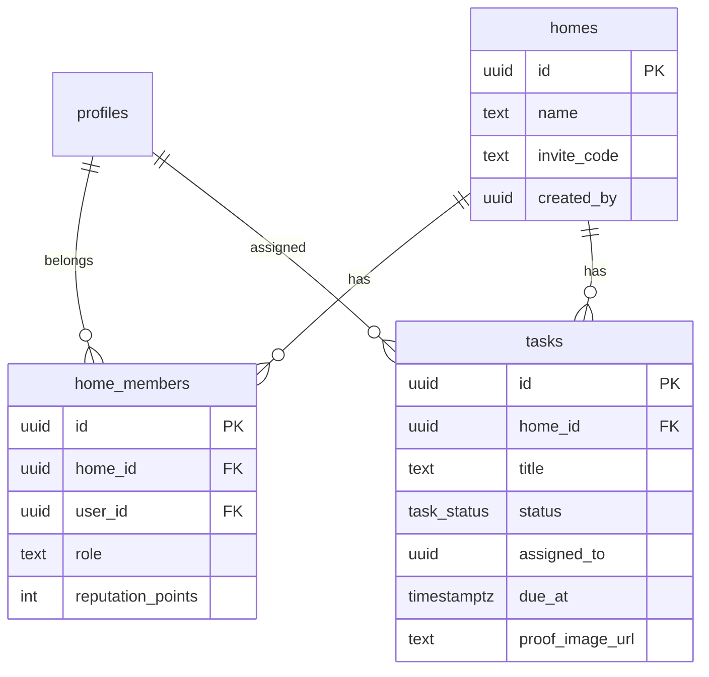

# Plan: Schema multi-tenant y RLS (Paso 2)

## Objetivo

Establecer el modelo de datos del piso compartido con aislamiento por `home_id`, alineado con `.cursorrules`.

## Alcance

**Incluye:**

- Tablas `profiles`, `homes`, `home_members`, `tasks`
- Enum Postgres `task_status` (PENDING … SKIPPED)
- Funciones RLS `is_home_member` / `is_home_owner`
- Políticas RLS en todas las tablas de hogar
- Trigger de perfil al registrarse (`auth.users` → `profiles`)
- Seed local mínimo
- Tipos TS (`database.types.ts`), schemas Zod y helper `requireHomeId`
- Tests unitarios del dominio

**Fuera de alcance (Paso 3+):**

- UI de login/registro
- Provider `activeHomeId` en React
- Storage de fotos / Realtime
- Asignación semanal automática de tareas

## Modelo

## Criterios de éxito

- Migración aplicable con `npm run db:reset`
- Ninguna query a tablas de hogar sin filtro `home_id` en el cliente tipado
- RLS impide leer datos de otro piso
- Tests de `requireHomeId`, schemas Zod y enum de estados en verde
