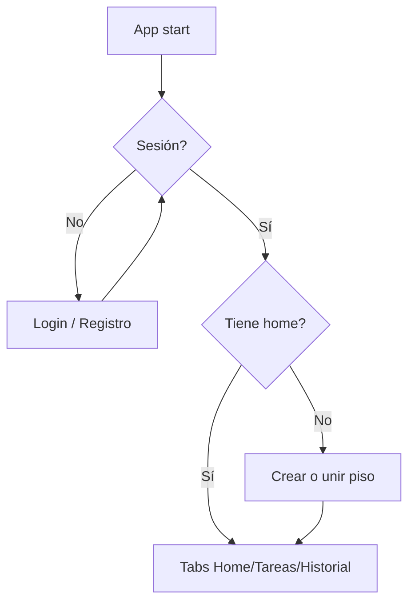

# Plan: Auth y hogar activo (Paso 3)

## Objetivo

Que un usuario pueda registrarse/iniciar sesión, crear o unirse a un piso, y operar siempre con un `home_id` activo.

## Alcance

**Incluye:**

- Cliente Supabase con persistencia de sesión (AsyncStorage)
- `AuthProvider` + hooks `useAuth`
- `HomeProvider` + `activeHomeId` en AsyncStorage
- RPCs `create_home`, `get_home_by_invite_code`, `join_home_by_invite_code`
- Pantallas login / registro / setup de piso
- Gate Expo Router: sin sesión → auth; sin hogar → onboarding; con ambos → tabs
- Tests de schemas, storage key y helpers de auth/home

**Fuera de alcance (Paso 4+):**

- Realtime / Storage fotos
- Asignación semanal de tareas
- UI completa del feed gamificado

## Flujo

## Criterios de éxito

- Login/registro funcionan contra Supabase local
- Tras login sin membresía se muestra setup de piso
- Crear piso genera invite code y fija `activeHomeId`
- Unir por código añade membership y fija `activeHomeId`
- Tabs solo accesibles con sesión + `home_id` activo
- `npm test` en verde
