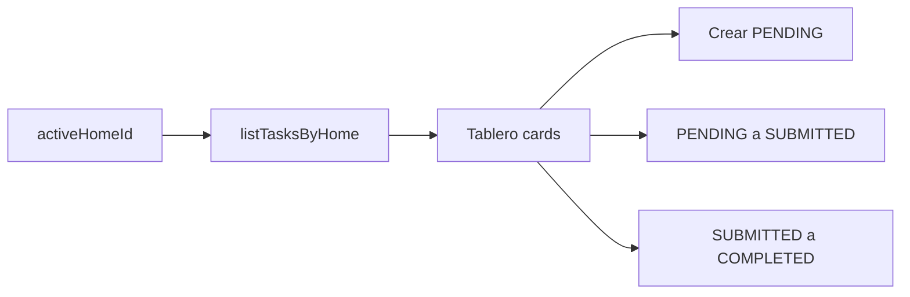

# Plan: Tablero de tareas (Paso 4)

## Objetivo

Sustituir el placeholder del tablero por datos reales de Supabase, siempre filtrados por el `home_id` activo.

## Alcance

**Incluye:**

- Listar tareas del piso activo (orden por `due_at`)
- Crear tarea (título, descripción opcional, vencimiento)
- Cards con estado, puntos y countdown
- Transiciones: `PENDING → SUBMITTED`, `SUBMITTED → COMPLETED`
- Resumen de cumplimiento en Home
- Historial básico (tareas cerradas)
- Tests de countdown, resumen y validación de transiciones

**Fuera de alcance (Paso 5+):**

- Foto de prueba (Storage) al entregar
- Impugnar / emojis de revisión
- Asignación semanal automática
- Realtime

## Flujo

## Criterios de éxito

- Ana/Bruno ven las 3 tareas seed en Tareas
- Crear tarea aparece en el tablero del mismo `home_id`
- Countdown visible en PENDING
- Home muestra conteos por estado
- `npm test` en verde
