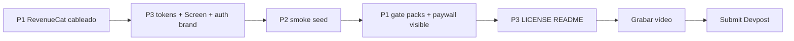

# Plan 31 — Shipaton supervivencia (Next Gen)

**Deadline:** 30 sep 2026, 23:45 PDT (~1 día).  
**Categoría:** Next Gen (estudiantes) → vídeo ≤2 min + repo público con licencia OSS. Sin App Store.  
**Fuera de alcance:** Realtime entre dispositivos, concurrencia multi-usuario, features nuevas de producto, CI/CD, EAS production.

## Diagnóstico (punto de partida)

| Requisito evento | Estado actual |
|------------------|---------------|
| SDK RevenueCat + ≥1 compra | ❌ Ausente |
| App runnable / demoable | ✅ Expo + Supabase local + seed |
| Repo público | ✅ `github.com/Celsiita/Hompany` |
| Licencia open source | ❌ No hay `LICENSE` |
| Atractivo visual | ⚠️ Funcional, estética genérica (azul Tailwind + fondos blancos) |
| Realtime multi-user | ❌ Solo `board-sync` in-process (OK para demo) |

---

## Pilar 1 — RevenueCat (bloqueante de elegibilidad)

### Objetivo

Que el vídeo y el código muestren claramente: configure SDK → offering/paywall → purchase (o Preview) → entitlement activo → feature desbloqueada.

### Monetización mínima (encaje producto)

**Entitlement:** `hompany_plus`  
**Producto demo:** suscripción mensual o lifetime “HOMPANY Plus” (Test Store).

**Qué desbloquea Plus (visible en demo):**

1. Packs de iconos **Hogar** y **Play** + importar pack JSON (hoy gratis → pasan a Plus).
2. Badge **Plus** en Ajustes / Feed.
3. Sección **HOMPANY Plus** en Ajustes: estado, “Mejorar a Plus”, restaurar compras.

Free sigue pudiendo usar el 100 % del core (tareas, gastos, agenda): el paywall no bloquea la convivencia, solo cosméticos. Así el vídeo enseña valor + monetización sin romper el producto.

### Trabajo técnico

| Paso | Detalle |
|------|---------|
| Dashboard RC | Proyecto HOMPANY → App (Test Store si no hay cuenta Apple/Google) → producto → entitlement `hompany_plus` → offering default → paywall remoto (opcional, o UI propia mínima) |
| Dependencias | `npx expo install react-native-purchases react-native-purchases-ui` + `expo-dev-client` |
| Config | `EXPO_PUBLIC_REVENUECAT_API_KEY` en `.env.example` / `app.config.ts` `extra` |
| Provider | `PurchasesProvider`: `Purchases.configure`, `logIn(user.id)` al autenticar, listener `CustomerInfo`, `isPlus` |
| Gate | `IconPackProvider` / Ajustes: packs no-Clásico y import JSON requieren `isPlus`; si no → presentar paywall |
| Paywall | Preferir `RevenueCatUI.presentPaywall()`; fallback botón “Restaurar” |
| Tests | Unit: helper `hasActiveEntitlement(info, 'hompany_plus')`; mock Purchases en Jest |

### Cómo demostrar sin App Store (Next Gen)

1. **Preferido si hay tiempo:** development build (`eas build` o `npx expo run:android`) + **RevenueCat Test Store** → compra real de prueba en vídeo.
2. **Fallback válido para código + vídeo:** Expo Go **Preview API Mode** del SDK (mocks) mostrando flujo UI Plus → “purchase” → packs desbloqueados. Documentar en README que la integración nativa está cableada y Test Store es el path de compras reales.

**Criterio done:** en Ajustes se ve Plus; al “comprar”, se desbloquean packs; el código importa `react-native-purchases` y comprueba el entitlement.

---

## Pilar 2 — Que lo que hay funcione (flujo demo)

### Objetivo

Un recorrido de ~90 s sin pantallas rotas, errores de red ni estados vacíos confusos. Seed reproducible.

### Script demo (orden fijo)

1. Login `ana@hompany.local` / `password123` (Piso Demo, invite `DEMO2026`).
2. **Home Feed:** salud del piso + ranking + info práctica.
3. **Agenda:** calendario con puntos; abrir un ítem.
4. **Tareas:** crear / completar con foto (o entregar una existente) → badge “En revisión”.
5. **Gastos:** ver balance / saldar o crear gasto rápido.
6. **Ajustes:** código invite + **HOMPANY Plus** (Pilar 1) → unlock iconos.
7. (Opcional 10 s) Segundo usuario Bruno solo si da tiempo; **no** depende de realtime.

### Checklist smoke (antes del vídeo)

Ejecutar en dispositivo/emulador con Supabase local (`npm run db:reset` → seed limpio):

- [ ] Auth login / logout
- [ ] Tabs Home / Tareas / Gastos / Ajustes sin crash
- [ ] Crear tarea one-shot con due date
- [ ] Entregar con foto (cámara o galería según settings del piso)
- [ ] Crear gasto + ver balance
- [ ] Cambiar pack de iconos (tras Plus)
- [ ] Tutorial Mico no bloquea el demo (skip o ya completado en seed)

### Bugs: solo bloqueantes

Prioridad **P0** (arreglo inmediato): crash, pantalla en blanco, no se puede login, no se listan tareas/gastos, paywall rompe Ajustes.  
**P1** (si sobra tiempo): textos cortados, filtros raros, formularios.  
**Ignorar:** realtime, liquidación “solicitar”, edge cases de recurrencia avanzada, planes 26/27 incompletos salvo que rompan el script.

### Docs/ops demo

- README: sección **Shipaton / Demo** con seed, env vars (Supabase + RevenueCat), cómo arrancar.
- `.env.example` completo (sin secretos reales).
- Confirmar `npm test` verde tras cambios de Plus / helpers.

**Criterio done:** el script anterior se puede grabar de un tirón sin reiniciar Metro ni resetear a mitad.

---

## Pilar 3 — Atractivo visual + entrega del evento

### 3A — Visual (pulido, no rediseño total)

Dirección: **hogar cálido y limpio** (no dashboard genérico ni tema “AI purple”).

| Área | Cambio concreto |
|------|-----------------|
| Tokens | Ampliar `palette` / NativeWind: fondo `cream-warm` suave, acento **teal** (`#0d9488`) o coral suave para CTAs; mantener semántica verde/ámbar/rojo en salud |
| `Screen` | Fondo off-white / gradiente muy sutil (LinearGradient o capas View), no blanco puro flat |
| Home Feed | HealthMeter + MetricsBar más “tarjeta viva” (sombra ligera, tipografía más clara); ranking más escaneable |
| Tabs | `tabBarActiveTintColor` al acento de marca; fondo tab bar coherente |
| Auth | Login/Register con marca **HOMPANY** hero (nombre grande), no solo form |
| Empty / loading | Reutilizar `MascotEmpty` / `MascotLoading` en huecos del script demo |
| Motion | 2–3 microinteracciones Reanimated: entrada Feed, press scale en cards/botón primary, transición sección Feed↔Agenda |
| Splash / icon | Ajuste rápido de colores splash al acento (assets existentes en `assets/images/`) |

**No hacer:** sistema de diseño nuevo, dark mode, animaciones en todas las pantallas, rediseño de formularios complejos.

**Criterio done:** en el primer frame del vídeo se reconoce marca + vibra “app de piso”, no “CRUD azul”.

### 3B — Entrega Shipaton

| Entregable | Acción |
|------------|--------|
| `LICENSE` | Añadir **MIT** en la raíz del repo |
| Repo público | Verificar GitHub público + licencia visible en About |
| README | Stack, setup, seed, RevenueCat, guion demo, nota Next Gen |
| Vídeo ≤2 min | Grabar script Pilar 2; YouTube/Vimeo público; sin música copyright |
| Devpost | Descripción corta + link repo + link vídeo + email académico |
| Icono / screenshot | Usar `assets/images/icon.png`; 1 captura 1179×2556 si el form lo pide (Next Gen prioriza vídeo+código) |

### Guion vídeo (máx. 120 s)

| t | Plano |
|---|--------|
| 0–10 | Logo/splash + “HOMPANY — convivencia gamificada en pisos compartidos” |
| 10–35 | Feed: salud + ranking |
| 35–55 | Tarea: countdown + entrega con foto |
| 55–75 | Gastos: balance “quién debe a quién” |
| 75–105 | Plus: paywall RevenueCat → unlock packs |
| 105–120 | Cierre: invite code + “hecho con Expo + Supabase + RevenueCat” |

---

## Orden de ejecución (día)

1. **Mañana:** Pilar 1 (dashboard RC + SDK + provider + gate packs).  
2. **Mediodía:** Pilar 3A visual mínimo (palette, Screen, auth, tabs, HealthMeter).  
3. **Tarde:** Pilar 2 smoke + fix P0.  
4. **Noche:** LICENSE, README, grabar, submit.

Si el tiempo aprieta: **P1 completo > script demo estable > LICENSE/README/vídeo > visual extra**. Sin P1 no hay submission válida.

---

## Criterios de aceptación globales

- [ ] `react-native-purchases` en dependencias y configurado al arrancar sesión.
- [ ] Entitlement `hompany_plus` controla al menos una feature visible.
- [ ] Script demo grabable sin errores bloqueantes.
- [ ] UI con identidad de marca (no solo azul genérico).
- [ ] `LICENSE` MIT + README con instrucciones Shipaton.
- [ ] Vídeo ≤2 min subido y formulario Devpost enviado antes del deadline.

## Notas para el implementador

- No tocar planes 26/27 salvo bugs P0 del script.
- No implementar Supabase Realtime en este plan.
- Claves RC solo vía env; nunca hardcodear secretos de producción en el repo (API key pública de Test Store sí puede ir documentada como ejemplo en `.env.example`).
